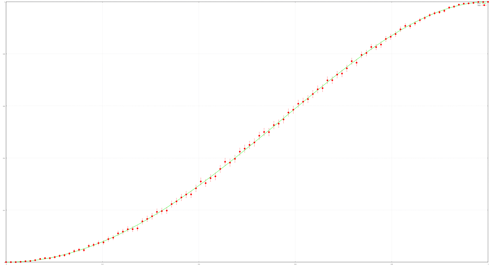
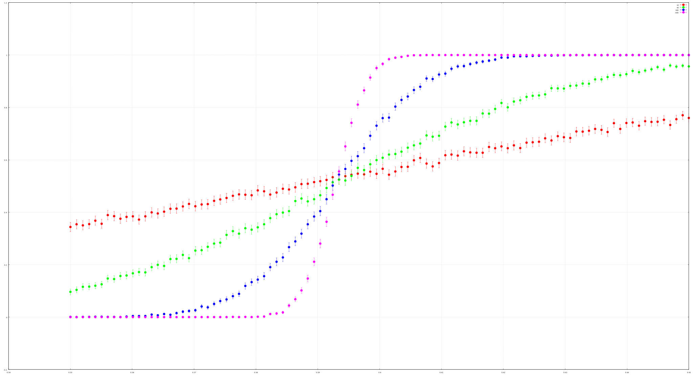

# Percolation

Work in progress, just did something quickly

Until I add an entry blog and more info on this, see: [wikipedia](https://en.wikipedia.org/wiki/Percolation_theory)

Gnuplot chart for a grid of size 2 versus exact values:

Critical probability:

