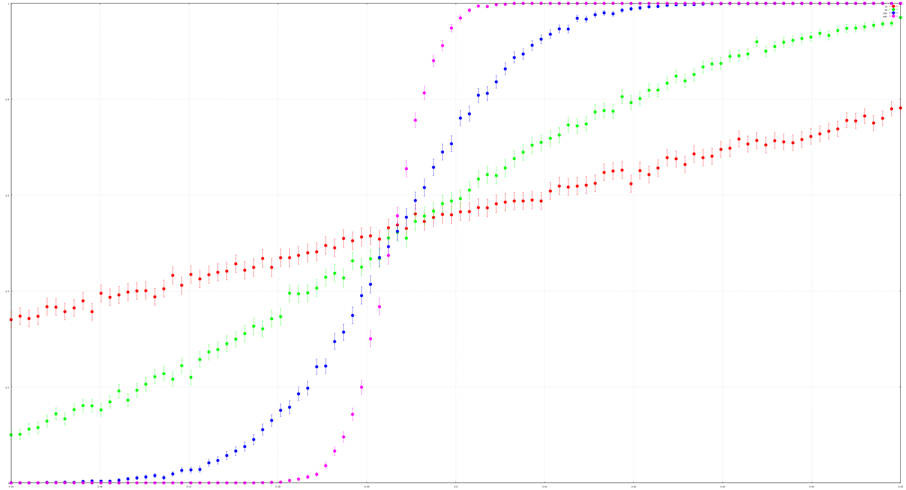

# Percolation

Computational Physics blog page: [Percolation in Fortran](https://compphys.go.ro/percolation-in-fortran/)

Here is an open access book on the subject: [Percolation Theory Using Python](https://link.springer.com/book/10.1007/978-3-031-59900-2)

Gnuplot chart for a grid of size 2 versus exact values:

Critical probability:

